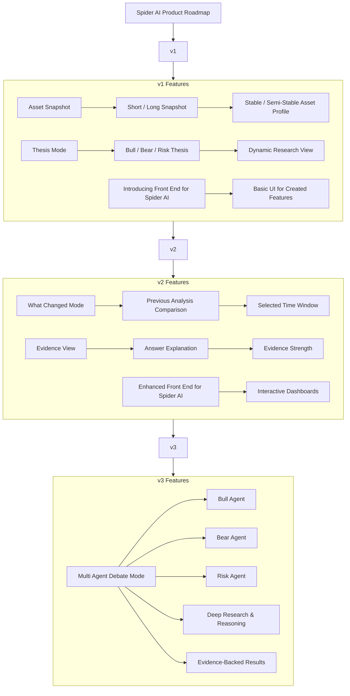

# spider-ai

spider-ai — an asset market research copilot for structured asset and market analysis.

## Product Roadmap

## Current Status

This project is in active backend development.

### Implemented

- FastAPI backend with versioned API (`/api/v1`)
- Local LLM integration through Ollama (`langchain-ollama`)
- **Asset snapshot feature** — generate short or long structured profiles for any asset (stock, ETF, FX, crypto, commodity, index)
- Chat endpoint for open-ended asset research queries
- Health endpoint
- Pydantic v2 request/response validation with enum-typed fields
- FastAPI `Depends`-based dependency injection wired across all endpoints
- Unit tests (25 tests, all passing)
- `ruff` formatter and pre-push git hook for code quality

## Run Locally

1. Install [Ollama](https://ollama.com)

2. Pull model:

   ```bash
   ollama pull llama3.1
   ```

3. Create `.env` from `.env.example`:

   ```bash
   cp .env.example .env
   ```

4. Install dependencies:

   ```bash
   uv sync
   ```

5. Run API:

   ```bash
   uv run uvicorn app.main:app --reload
   ```

6. Open interactive docs: http://localhost:8000/docs

## Run with Docker Compose

```bash
docker compose up --build
```

> If Ollama is running on the host machine (not in Docker), set `OLLAMA_BASE_URL=http://host.docker.internal:11434` in your `.env`.

## Run Tests

```bash
uv run pytest -q
```

## API Endpoints

| Method | Path | Description |
|--------|------|-------------|
| `GET`  | `/api/v1/health` | Health check |
| `POST` | `/api/v1/chat` | Open-ended asset research chat |
| `POST` | `/api/v1/asset/snapshot` | Generate a short or long structured asset profile |

### Health check

```bash
curl http://localhost:8000/api/v1/health
```

### Chat

```bash
curl -X POST http://localhost:8000/api/v1/chat \
  -H "Content-Type: application/json" \
  -d '{"message": "Give me a short research-style overview of NVIDIA.", "asset": "NVDA"}'
```

### Asset snapshot (short)

```bash
curl -X POST http://localhost:8000/api/v1/asset/snapshot \
  -H "Content-Type: application/json" \
  -d '{"asset": "NVDA", "asset_type": "stock", "mode": "short"}'
```

### Asset snapshot (long)

```bash
curl -X POST http://localhost:8000/api/v1/asset/snapshot \
  -H "Content-Type: application/json" \
  -d '{"asset": "BTC", "asset_type": "crypto", "mode": "long"}'
```

## Project Structure

```
app/
  main.py                         # FastAPI app factory
  api/
    dependencies.py               # FastAPI Depends providers
    v1/
      router.py                   # Mounts all v1 endpoint routers
      endpoints/
        health.py                 # GET  /api/v1/health
        chat.py                   # POST /api/v1/chat
        asset_snapshot.py         # POST /api/v1/asset/snapshot
  core/                           # Config, logging, exceptions
  domain/schemas/
    asset_snapshot.py             # AssetSnapshot, ShortAssetSnapshot, LongAssetSnapshot, AssetSnapshotRequest
    chat.py                       # ChatRequest, ChatResponse
    health.py                     # HealthResponse
  llm/
    base.py                       # BaseChatModelClient (abstract)
    ollama_client.py              # OllamaChatClient (langchain-ollama)
    prompts/
      feature_snapshot_prompt.py          # SHORT_ / LONG_ASSET_SNAPSHOT_PROMPT templates
      feature_snapshot_prompt_builder.py  # AssetSnapshotPromptBuilder
      system_prompts.py                   # BASE_SYSTEM_PROMPT
  services/
    chat_service.py               # ChatService
    asset_snapshot_service.py     # AssetSnapshotService
  tools/                          # Future: tool abstractions
  retrieval/                      # Future: RAG
  workflows/                      # Future: workflow orchestration

tests/                            # pytest suite (25 tests)
  test_health.py
  test_chat.py
  test_asset_snapshot_service.py
  test_prompt_builder.py

scripts/
  pre-push                        # Git pre-push hook (cross-platform sh)
  setup-hooks.py                  # Installs the hook into .git/hooks/
  README.md                       # Developer tooling guide
```

## Code Quality

This project uses [`ruff`](https://docs.astral.sh/ruff/) for formatting and linting.

```bash
# Format
uv run ruff format app/ tests/

# Check without changes
uv run ruff format --check app/ tests/

# Lint and auto-fix
uv run ruff check --fix app/ tests/
```

A pre-push git hook runs the format check automatically before every push. To install it:

```bash
python scripts/setup-hooks.py
```

## Roadmap

- ~~Asset snapshot (short / long)~~ ✅
- Thesis mode (bull / bear / risk)
- Market data tools
- RAG / retrieval
- Evidence-aware answers
- What changed mode
- Evaluation & observability
- Multi-agent debate mode

---

> **Disclaimer:** This tool is not financial advice.
