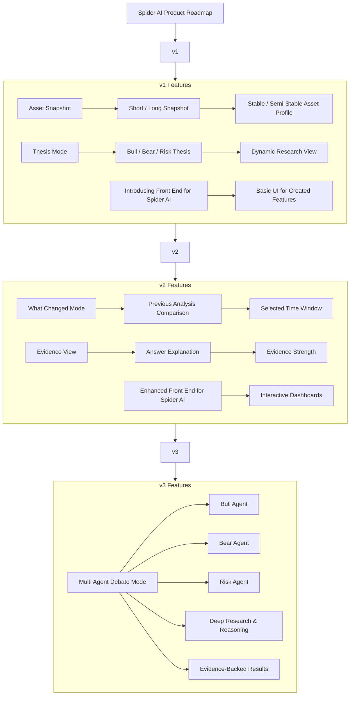

# spider-ai

spider-ai — an asset market research copilot for structured asset and market analysis.

## Product Roadmap

```mermaid
flowchart TB
 subgraph V1_FEATURES["v1 Features"]
    direction LR
        S1["Asset Snapshot"]
        T1["Thesis Mode"]
        F1["Introducing Front End for Spider AI"]
        S1A["Short / Long Snapshot"]
        S1B["Stable / Semi-Stable Asset Profile"]
        T1A["Bull / Bear / Risk Thesis"]
        T1B["Dynamic Research View"]
        F1A["Basic UI for Created Features"]
  end
 subgraph V2_FEATURES["v2 Features"]
    direction LR
        W1["What Changed Mode"]
        E1["Evidence View"]
        F2["Enhanced Front End for Spider AI"]
        W1A["Previous Analysis Comparison"]
        W1B["Selected Time Window"]
        E1A["Answer Explanation"]
        E1B["Evidence Strength"]
        F2A["Interactive Dashboards"]
  end
 subgraph V3_FEATURES["v3 Features"]
    direction LR
        M1["Multi Agent Debate Mode"]
        M1A["Bull Agent"]
        M1B["Bear Agent"]
        M1C["Risk Agent"]
        M1D["Deep Research & Reasoning"]
        M1E["Evidence-Backed Results"]
  end
    A["Spider AI Product Roadmap"] --> V1["v1"]
    V1 --> V1_FEATURES
    S1 --> S1A
    S1A --> S1B
    T1 --> T1A
    T1A --> T1B
    F1 --> F1A
    V1_FEATURES --> V2["v2"]
    V2 --> V2_FEATURES
    W1 --> W1A
    W1A --> W1B
    E1 --> E1A
    E1A --> E1B
    F2 --> F2A
    V2_FEATURES --> V3["v3"]
    V3 --> V3_FEATURES
    M1 --> M1A & M1B & M1C & M1D & M1E
```
## Current Status

This project is a FastAPI backend for structured asset research workflows. The
main implemented workflow is Asset Snapshot: it resolves an asset input,
retrieves normalized provider context through capability tools, and asks a
local Ollama LLM to synthesize a schema-validated structural snapshot.
The workflow is routed through `AssetSnapshotRouterGraph`; only the stock
subgraph is implemented today.

### Implemented

- FastAPI backend
- Local LLM integration through Ollama
- LangChain `ChatOllama` client
- LangGraph Asset Snapshot workflow
- Asset Snapshot router graph with implemented stock subgraph
- Optional ambiguous asset resolver before tool execution
- yfinance-backed company profile provider for stocks
- Optional FMP integration for profile fallback and peers
- Five-hour in-memory TTL caches for normalized tool results
- Local SQLite persistence for validated Asset Snapshot research artifacts
- Structured `StockAssetSnapshot` output with profile, drivers, and risks
- Ollama schema-constrained snapshot generation with a single model call
- Rich terminal debug logs for workflow and LLM tracing
- Basic chat endpoint
- Health endpoint
- LangSmith observability integration
- Production-minded project structure

## Run Locally

1. Install [Ollama](https://ollama.com)

2. Pull model:

   ```bash
   ollama pull llama3.1
   ```

3. Create `.env` from `.env.example`:

   ```bash
   cp .env.example .env
   ```

4. Install dependencies:

   ```bash
   uv sync
   ```

5. Run API:

   ```bash
   uv run uvicorn app.main:app --reload
   ```

6. Open interactive docs: http://localhost:8000/docs

## Local Research Persistence

Validated Asset Snapshots are stored locally in SQLite after generation and
Pydantic validation succeed. No separate database server is required.

The default location is:

```text
./data/spider-ai.db
```

Override it in `.env` when needed:

```bash
SPIDER_AI_DB_PATH=/absolute/path/to/spider-ai.db
```

FastAPI startup creates the parent directory and applies pending SQL migrations.
To initialize a development database, start the API normally. To reset it, stop
the API and delete the configured database file; startup will recreate it.
Docker Compose bind-mounts the repository's `data/` directory at `/app/data`,
so the same database remains visible on the host and survives container recreation.

Each persisted snapshot consists of a generic research artifact, one snapshot
subtype row, the validated `StockAssetSnapshot` JSON, and a frozen JSON bundle
of the normalized profile, peers, fundamentals, and `data_scope` used during
generation. Raw provider payloads, rendered prompts, chain-of-thought, and
database identifiers are not included in the public Snapshot response.
The snapshot is stored in `output_json`. A separate evidence row preserves the
frozen normalized provider contexts used for generation.

## Local Debug Logs

Pretty terminal logs are enabled by default in local debug mode.

Use these `.env` flags to control workflow tracing:

```bash
APP_PRETTY_LOGS=true
APP_LOG_FLOW_STEPS=true
APP_LOG_LLM_PROMPTS=false
APP_LOG_LLM_OUTPUTS=false
APP_LOG_PREVIEW_CHARS=600
```

Turn on `APP_LOG_LLM_PROMPTS=true` or `APP_LOG_LLM_OUTPUTS=true` when you need
to inspect the exact prompt/output preview that went through Ollama. Keep them
off for normal local runs if the payload may contain sensitive user input.

## Structured Snapshot Generation

Stock Asset Snapshot generation calls `with_structured_output(response_schema)`
with its Pydantic schema, then invokes the structured model once. The installed
ChatOllama defaults to `method="json_schema"` and `include_raw=False`, passing the
JSON schema to Ollama and validating the response with Pydantic. There is no
application-level retry, repair prompt, or raw-response wrapper. Errors follow
the existing controlled generation-error path. Chat, asset resolution, and eval
judging keep their existing behavior. Schema enforcement does not establish
factual accuracy or whether every supplied peer was acknowledged.

Structured generation returns a typed `StockAssetSnapshot` directly into the
graph's `validated_output`. Finalization sets request/workflow-owned metadata
(`asset`, `asset_type`, `data_scope`) on a copy, restores missing peer tickers from
unambiguous supplied identities, and warns if supplied peers were omitted.
Unknown/ambiguous identity matches are not guessed. There is no intermediate JSON
string in graph state or repeated JSON
parsing there.
The current peer-landscape contract intentionally changes API and stored snapshot
JSON. See [peer-landscape compatibility](docs/peer_landscape.md#compatibility).

## Market Data Providers

yfinance is the default free company profile provider. FMP is optional and the
project runs without it.

To enable FMP peer context and profile fallback:

```bash
FMP_ENABLED=true
FMP_API_KEY=your_fmp_api_key
FMP_BASE_URL=https://financialmodelingprep.com/stable
```

When FMP is disabled, missing, rate-limited, or incomplete, Asset Snapshot still
runs. The graph continues with empty peers and optional yfinance financial
fundamentals. Static hardcoded peer and sector mappings are not used as production
data sources.

FMP returns **provider-reported peers**, not necessarily direct competitors.
`CompanyPeersTool` enriches up to 10 distinct candidate tickers using the shared
`CompanyProfileTool` (yfinance first, configured FMP fallback). Its tool-level
TTL cache is reused; up to 3 profile lookups run concurrently with a 15-second
timeout per lookup. Failed or unattempted candidates remain identity-only.
The LLM compares target and compact peer profiles to generate `peer_type`,
`relationship_area` and `why_relevant`. The latter combines the relationship and
its structural economic significance in one explanation. These are analytical
outputs, not provider fields. Every identifiable supplied peer gets one
`peer_landscape` entry, even without enrichment. `peer_type` is one of
`direct_competitor`, `indirect_competitor`, `comparable`, or `unclear`.
Provider evidence is primary. Widely established, high-confidence, structurally
persistent model knowledge may supplement compact/missing profiles, but never
override evidence or invent numbers, recent relationships, or obscure facts.
Broad similarity can support `comparable`; insufficient reliable support calls for
`unclear`. Risk `related_entities` identify only peers connected to that risk's
mechanism, not all landscape entries and not necessarily competitors.
Missing enrichment is not evidence that the provider's peer selection is wrong.
No economic mechanism is invented just to fill an entry. An empty landscape is
appropriate when no identifiable peers were supplied. Enriched profiles and their
provenance are saved in evidence JSON.
SQLite tables and evidence JSON are unchanged; the public snapshot JSON is an
intentional breaking change with no legacy aliases.

Peer profiles now have a separate, deterministic **prompt projection**: ticker,
name, sector, industry, and a compact business summary. Summaries normalize
whitespace and retain up to five opening sentences within a 1,200-character
budget, or a word-boundary prefix with `...` if the first sentence does not fit.
Shorter descriptions remain unchanged after whitespace normalization when within
both limits. No facts are rewritten, no peers are removed, and no extra LLM
call is made. The target company's existing profile rendering is unchanged.
Full enriched profiles remain in tool caches and persisted evidence. Discovery
and profile-provider provenance are identified separately in the prompt.

DEBUG logs expose `snapshot_prompt.peer_context` with peer count, representation,
and character count. Native model traces can expose Ollama's token-usage metadata;
the structured client returns only the validated model, not raw response metadata.
Character counts alone do not guarantee that the prompt fits the model context window.
The [eval guide](evals/README.md#peer-context-ablation) describes comparisons via
`--peer-context names_only|compact|full`; production defaults to `compact`.

`CompanyProfileTool`, `CompanyPeersTool`, and `CompanyFundamentalsTool` cache
successful normalized results for **five hours** in memory. Peer results include
the completed enrichment attempt, even when some profiles are unavailable.
Cache hits return independent copies and do not extend the TTL. Empty results or
failures are not cached. After expiry, the next call fetches fresh vendor data
through the provider; there is no additional provider-level data cache.
Each tool's TTL is independent, so still-valid peer profile entries can be reused
when a peer list is refreshed. The `@cache` decorators on dependency factories
reuse tool/provider **objects**, keeping these data caches alive across requests.
Caches are process-local and reset on restart. The old provider-cache TTL
environment settings are no longer used.

Asset Snapshot v1 intentionally stays business-model-first:

- Core: company name, sector, industry, business summary, and country.
- Optional enrichment: peers and yfinance revenue, revenue growth, operating
  margin, and normalized debt-to-equity ratio.
- Financial metadata: reporting currency, latest fiscal-year end, and most
  recent quarter when supplied by yfinance.
- Not collected for v1: gross margin, net margin, or return on equity.

A usable company profile is sufficient for a provider-grounded snapshot.
Missing financial signals do not fail or downgrade the workflow; only a missing
profile activates `model_static_knowledge_fallback`.

Asset Snapshot fundamentals provide quantitative context for understanding
business economics and structural drivers/risks. They are interpreted together
with the company profile; they do not estimate fair value or determine whether
a stock is cheap, expensive, bullish, or bearish. Market capitalization and
valuation multiples are intentionally outside this Snapshot context.

`debt_to_equity_ratio` is a normalized multiple: `2.0` means debt is
approximately 2x shareholders' equity. The yfinance adapter converts Yahoo's
percentage-style `debtToEquity` value before creating the domain context; for
example, Yahoo `200` becomes Spider-AI `2.0`.

The financial fields do not share an asserted global period. Revenue, growth,
margin, and leverage may have different provider-defined temporal semantics;
the supplied fiscal-year and quarter dates are reference metadata, not proof
that every metric belongs to the same reporting period.

## Run with Docker Compose

```bash
docker compose up --build
```

> If Ollama is running on the host machine (not in Docker), set `OLLAMA_BASE_URL=http://host.docker.internal:11434` in your `.env`.

## Run Tests

```bash
uv run pytest
```

Live LLM resolver tests are opt-in because they call the configured Ollama
model:

```bash
RUN_LIVE_LLM_RESOLVER_TESTS=true uv run pytest tests/test_asset_resolver_live.py -m live_llm -vv
```

## Asset Snapshot Evals

The local Stock Asset Snapshot eval harness reuses the production router,
subgraph, tools, prompt builder, and response schema while replacing market-data
providers with frozen fixtures. Its synthetic v1 dataset is intentionally marked
`pending_manual_review` and is excluded from default runs until a reviewer
approves individual cases.

```bash
# Validate dataset structure and review metadata without calling an LLM
uv run python -m evals.asset_snapshot.run --validate-only

# Run approved cases only (the default)
uv run python -m evals.asset_snapshot.run --dataset stock_snapshot_v1_peer_landscape_v2

# Explicit non-baseline exploration of pending cases
uv run python -m evals.asset_snapshot.run \
  --dataset stock_snapshot_v1_peer_landscape_v2 \
  --include-pending
```

See [`evals/README.md`](evals/README.md) and
[`evals/datasets/stock_snapshot_v1_review.md`](evals/datasets/stock_snapshot_v1_review.md)
for grader behavior, approval steps, and the manual-review checklist. Semantic
evals use a separately configurable judge model and are never run implicitly by
the test suite.

Compare the verbose reference feature prompt with the statically compressed prompt
on the same frozen cases, using existing graders plus blinded two-order pairwise
judging (tie allowed):

```bash
uv run python -m evals.asset_snapshot.run --compare-prompts \
  --case amzn_peer_profiles_001 --case ma_sparse_peers_001
```

Add `--pairwise-only` to skip individual semantic graders, or
`--deterministic-only` to skip all judges. Both still generate two snapshots per
case. Reports include full outputs, per-case scores, exact judge quotes, prompt
sizes, and settings. Both prompt variants now use the same peer-landscape schema
and stable-knowledge policy; the earlier 40.1% compression measurement belongs to
the previous contract. Smaller prompts alone do not prove quality improvement. See the
[coverage audit](docs/asset_snapshot_prompt_compression.md) and
[A/B guide](evals/README.md#original-vs-compressed-prompt-evaluation).

## API Endpoints

| Method | Path | Description |
|--------|------|-------------|
| `GET`  | `/api/v1/health` | Health check |
| `POST` | `/api/v1/chat` | Open-ended asset research chat |
| `POST` | `/api/v1/asset/snapshot` | Generate a short or long structured asset profile |

### Health check

```bash
curl http://localhost:8000/api/v1/health
```

## Get Asset Snapshot

```bash
curl -X POST http://localhost:8000/api/v1/asset/snapshot \
  -H "Content-Type: application/json" \
  -d '{
    "asset": "NVDA",
    "asset_type": "stock"
  }'
```

The Asset Snapshot workflow currently supports `stock` assets through
`StockSnapshotSubgraph`. yfinance provides the default company profile and any
available supporting financial fundamentals. FMP can provide company peers and
profile fallback. ETF, commodity, and crypto subgraphs are planned extension
points but are not implemented yet; unsupported asset types return a controlled
client error instead of falling through to stock logic.

## Test Chat

```bash
curl -X POST http://localhost:8000/api/v1/chat \
  -H "Content-Type: application/json" \
  -d '{
    "message": "Give me a research-style overview of NVIDIA.",
    "asset": "NVDA"
  }'
```

## Project Structure

```
app/
  main.py               # FastAPI app factory
  api/v1/               # HTTP layer — routers and endpoints
  agents/               # Agent packages, including Asset Snapshot graphs/tools
  core/                 # Config, logging, exceptions
  domain/schemas/       # Pydantic request/response models
  llm/                  # LLM provider abstractions
  market_data/          # yfinance/FMP providers and normalization
  services/             # Business logic
  agents/.../tools/     # Workflow-facing Asset Snapshot tools

tests/                            # pytest suite (25 tests)
  test_health.py
  test_chat.py
  test_asset_snapshot_service.py
  test_prompt_builder.py

scripts/
  pre-push                        # Git pre-push hook (cross-platform sh)
  setup-hooks.py                  # Installs the hook into .git/hooks/
  README.md                       # Developer tooling guide
```

## Code Quality

This project uses [`ruff`](https://docs.astral.sh/ruff/) for formatting and linting.

```bash
# Format
uv run ruff format app/ tests/

# Check without changes
uv run ruff format --check app/ tests/

# Lint and auto-fix
uv run ruff check --fix app/ tests/
```

A pre-push git hook runs the format check automatically before every push. To install it:

```bash
python scripts/setup-hooks.py
```

## Roadmap

- Broader market data coverage
- Better ambiguous asset resolution
- Evidence-aware answers
- Evaluation
- Additional workflow-level observability

---

> **Disclaimer:** This tool is not financial advice.
