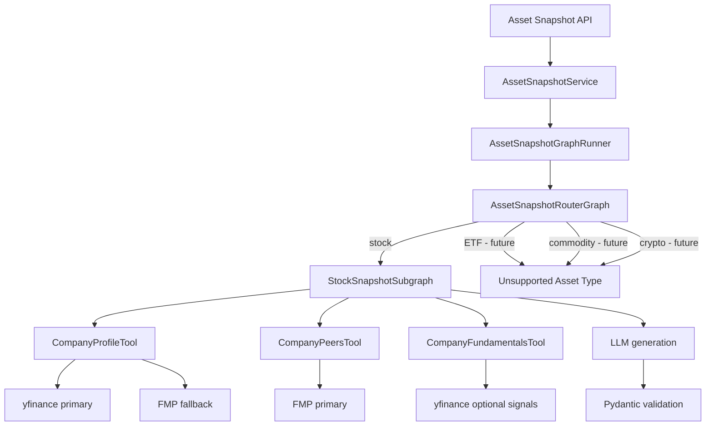
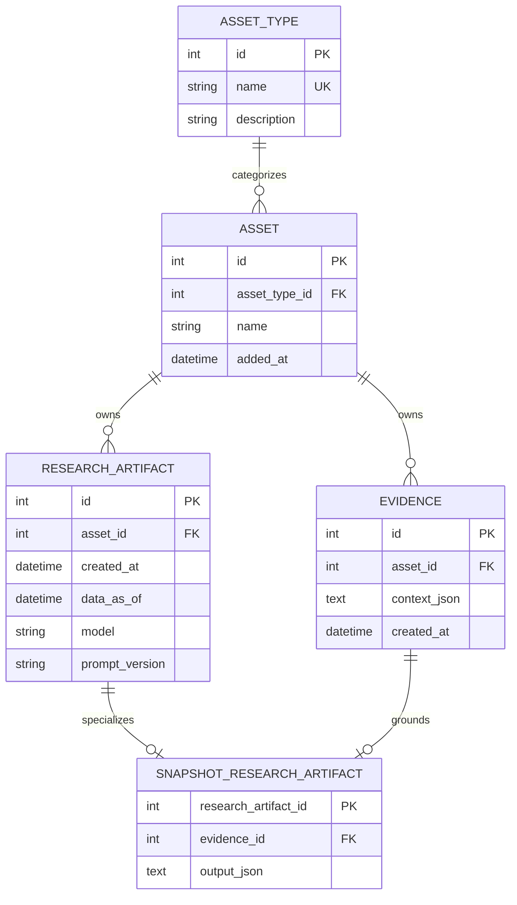
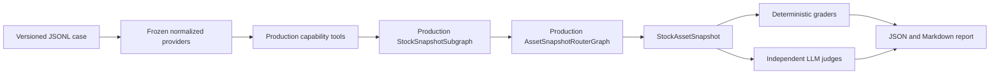

# Architecture

This document describes spider-ai — an asset market research copilot.

## Overview

The project is a FastAPI application that delegates LLM calls to a local Ollama
service. The codebase uses a vertical agent package for the Asset Snapshot
capability: the router graph, stock subgraph, graph state, nodes, runner,
resolver, and workflow-facing tools live together under
`app/agents/asset_snapshot/`.

Horizontal infrastructure remains outside the agent package. Market-data
providers live in `app/market_data/`, LLM adapters live in `app/llm/`, Pydantic
schemas live in `app/domain/schemas/`, and HTTP/service wiring lives in
`app/api/` and `app/services/`. Local SQLAlchemy/SQLite persistence lives in
`app/infrastructure/db/`.

### Request flow (high-level)

```
Client -> HTTP -> FastAPI endpoints (app/api/v1/endpoints)
                             -> Services (app/services)
                             -> AssetSnapshotGraphRunner
                             -> AssetSnapshotRouterGraph
                             -> StockSnapshotSubgraph
                             -> Capability tools
                             -> Market data providers
                             -> LLM client (app/llm) -> Ollama
                             -> validated snapshot persistence -> SQLite
```

## Main components

- **API**: `app/main.py` mounts the v1 router (`/api/v1`) defined at [app/api/v1/router.py](app/api/v1/router.py). Endpoints live under [app/api/v1/endpoints](app/api/v1/endpoints).
- **Services**: `app/services/` owns application-level use cases. `AssetSnapshotService` delegates to the Asset Snapshot graph runner; `ChatService` calls the LLM client directly.
- **Asset Snapshot agent**: `app/agents/asset_snapshot/` owns Asset Snapshot orchestration: router graph, stock subgraph, graph states, nodes, runner, resolver helpers, and capability tools.
- **Capability tools**: `app/agents/asset_snapshot/tools/` exposes provider-normalized data to graph nodes through concrete tool classes such as `CompanyProfileTool`, `CompanyPeersTool`, and `CompanyFundamentalsTool`.
- **Schemas**: Pydantic models in `app/domain/schemas/` define request/response models and normalized provider context.
- **Market data**: `app/market_data/` contains provider protocols, in-memory TTL caches, the yfinance profile provider, and optional FMP provider.
- **LLM clients**: Adapter layer in `app/llm/` (e.g. `ollama_client.py`) — wraps `langchain-ollama`/`ChatOllama`.
- **Prompts**: `app/llm/prompts/` contains stock prompt construction and system prompts.
- **Core**: `app/core/` contains configuration, rich terminal logging, and shared utilities.
- **Persistence**: `app/infrastructure/db/` contains the async SQLite engine,
  SQL migrations, typed ORM models, and focused DAO classes.

## Package boundaries

The Asset Snapshot code follows a vertical feature-package style:

```text
app/agents/asset_snapshot/
  runner.py                    # service-facing graph runner
  asset_resolver.py             # ambiguous stock input pre-check helpers
  router/
    graph.py                    # top-level AssetSnapshotRouterGraph
    routing.py                  # asset-type routing/finalization nodes
    state.py                    # minimal router state
  stock/
    graph.py                    # StockSnapshotSubgraph wiring
    nodes.py                    # stock-specific graph nodes
    state.py                    # stock-specific graph state
  tools/
    company_profile.py          # yfinance primary, FMP fallback
    company_peers.py            # FMP peers, empty fallback
    company_fundamentals.py     # optional yfinance signals, empty fallback
```

Dependency direction:

```text
API endpoint
  -> AssetSnapshotService
  -> AssetSnapshotGraphRunner
  -> AssetSnapshotRouterGraph
  -> StockSnapshotSubgraph
  -> Company*Tool classes
  -> market_data providers

Validated result
  -> SnapshotArtifactPersistenceService
  -> focused DAOs
  -> SQLite
```

The router chooses the asset-domain workflow. Stock-specific prompts, nodes,
fallback behavior, and tool calls stay inside the stock subgraph. Vendor API
selection stays inside tools/providers.

## API surface (important endpoints)

- `GET /api/v1/health` — health check, returns `{status: "ok", service: "<name>"}`.
- `POST /api/v1/asset/snapshot` — runs the Asset Snapshot workflow. Expected JSON shape:

```json
{ "asset": "NVDA", "asset_type": "stock" }
```

Response model: `StockAssetSnapshot`, containing `summary`, `business_or_asset_profile`,
`market_context`, `competitive_landscape`, `structural_drivers`, `structural_risks`,
and `data_scope`.

- `POST /api/v1/chat` — main chat endpoint. Expected JSON shape:

```json
{ "message": "<user question>", "asset": "<optional asset id>" }
```

Response model: `{ "answer": "<text>", "model": "<model-name>" }`.

Note: `/chat` without the `/api/v1` prefix will return 404. The chat endpoint expects `POST`, not `GET`.

## Asset Snapshot workflow

External code calls only `AssetSnapshotService`, which delegates to
`AssetSnapshotGraphRunner`. The runner invokes `AssetSnapshotRouterGraph`. The
router chooses the asset-domain workflow and currently routes only `stock`
requests into `StockSnapshotSubgraph`.



Router node order:

```
request
  -> route_asset_type
  -> stock_snapshot_node, when asset_type == stock
  -> finalize_router_result
```

Stock subgraph node order:

```
request
  -> ambiguous_asset_resolution
  -> company_profile
  -> company_peers
  -> fundamentals
  -> generate_snapshot
  -> validate_snapshot
```

Router state is intentionally minimal: request, selected asset type, validated
output, an opaque frozen `AssetSnapshotEvidence` bundle, and a controlled error
string. Individual company profile, peers, fundamentals, prompts, raw LLM
output, and selected providers are not exposed as router-state fields.

Stock state contains stock-specific workflow values such as optional
`resolved_asset`, normalized `AssetProfileContext`, `CompanyPeersContext`,
`CompanyFundamentalsContext`, generated prompt, raw LLM output, validated
output, data scope, and errors.

Important behavior:

- Ticker-like stock inputs skip the LLM resolver.
- Ambiguous stock inputs may call the LLM resolver before tool execution.
- Resolver output is parsed as JSON, validated with Pydantic, and sanity-checked
  before use.
- Tool calls still happen after resolution attempts; the LLM resolver never
  replaces market-data grounding.
- Graph nodes are capability-based, not vendor-based. Vendor fallback belongs
  inside tools/providers.
- Peer and fundamentals tools derive their asset symbol from
  `AssetProfileContext` when provider-grounded profile context exists. Without
  a profile, they return empty fallback contexts and do not make symbol-only
  provider calls.
- If profile, peers, or fundamentals are missing, the graph continues with
  explicit fallback context.
- Unsupported asset types fail explicitly and do not execute stock logic.
- The final LLM output is parsed defensively to tolerate fenced JSON, then
  validated as `StockAssetSnapshot`.

## Market data

The stock subgraph calls Asset Snapshot capability tools:

- `CompanyProfileTool`: yfinance primary, FMP fallback if configured.
- `CompanyPeersTool`: FMP primary if configured, otherwise empty peers.
- `CompanyFundamentalsTool`: selected optional signals already available from
  yfinance, otherwise an empty normalized context.

The graph depends on concrete capability tool classes, not provider protocols or
vendor clients. Provider protocols remain in `app/market_data/providers.py`,
where they describe the vendor-adapter boundary.

Capability tools never construct providers internally. The API dependency
composition root creates the shared yfinance provider and includes FMP only when
it is configured. A configured profile fallback is still selected dynamically
at request time when the primary provider fails or returns no usable profile.

Provider responsibilities:

- call concrete vendors such as yfinance or FMP
- normalize raw vendor data into domain context schemas
- avoid exposing raw yfinance/FMP responses outside providers
- return `None` or empty contexts when no useful data is available

yfinance is the required free/default profile provider for stocks and may also
normalize selected optional signals from the same `.info` payload. FMP is
limited to profile fallback and peers when `FMP_ENABLED=true` and `FMP_API_KEY`
is set. It does not call premium ratios, growth, or income-statement endpoints
for Asset Snapshot. Static hardcoded peer and sector mappings are not production
data sources.

`InMemoryTTLAssetProfileCache` caches successful yfinance profile contexts by
`asset + asset_type`. The same yfinance provider instance caches normalized
optional signals, avoiding a second `.info` call in the normal workflow.
`InMemoryTTLCache` is also used for FMP contexts. Defaults are 24 hours and
configurable via `ASSET_PROFILE_CACHE_TTL_SECONDS` and `FMP_CACHE_TTL_SECONDS`.

### Frozen Asset Snapshot v1 data contract

Asset Snapshot v1 is business-model-first. The company profile is the only
core provider-grounded capability, with `business_summary` as its highest-value
field alongside name, sector, industry, and country.

- Optional enrichment: peers and yfinance revenue, revenue growth, operating
  margin, and normalized debt-to-equity ratio.
- Financial metadata when supplied: reporting currency, latest fiscal-year end,
  and most recent quarter.
- Outside the active v1 contract: gross margin, net margin, and return on equity.

Missing peers or financial signals never makes a snapshot fail or become
ungrounded. A usable company profile is sufficient for provider-grounded
generation. If no profile is available, the graph uses
`model_static_knowledge_fallback`.

Deterministic `data_scope` values describe meaningful coverage rather than
individual missing metrics: `profile_only`, `profile_with_peers`,
`profile_with_financial_signals`,
`profile_with_peers_and_financial_signals`, `fmp_profile_fallback`, or
`model_static_knowledge_fallback`.

## Prompting and validation

`StockSnapshotPromptBuilder` builds the stock generation prompt from:

- base system prompt
- Asset Snapshot task prompt
- normalized provider context when available
- explicit fallback context when provider data is unavailable

The LLM is never given raw vendor JSON. It receives clean provider context
blocks for company profile, competitive context, and optional financial
fundamentals. The prompt explicitly makes the business model primary and uses
financial values only as quantitative evidence for interpreting scale, growth
or maturity, operating economics, leverage, and financing sensitivity.

Asset Snapshot fundamentals are not a valuation context. They must not estimate
fair value, classify a stock as cheap or expensive, or turn high growth, high
margin, or high leverage into automatic bullish/bearish conclusions. Market
capitalization and valuation multiples belong outside this Snapshot contract.

The domain field `debt_to_equity_ratio` is always an actual multiple: `2.0`
means debt is approximately 2x shareholders' equity. Vendor adapters own any
semantic conversion. In particular, the yfinance adapter normalizes Yahoo
`debtToEquity=200` to `debt_to_equity_ratio=2.0`; tools, workflows, and prompts
never handle Yahoo's percentage-style representation.

`CompanyFundamentalsContext` intentionally has no global period type. Provider
metrics can have mixed temporal semantics: revenue may be trailing, leverage
may be point-in-time, and growth may use a provider-specific comparison period.
Fiscal-year-end and most-recent-quarter dates are preserved as provider metadata
without claiming that every metric belongs to either date.

Final output must validate against `StockAssetSnapshot`.

## Research artifact persistence

SQLite is used because Spider-AI is currently a local-first, single-user
application. It provides durable indexed local reads without another service,
and keeps the initial artifact lineage relational and inspectable. SQLAlchemy
uses the async `sqlite+aiosqlite` driver.

The FastAPI lifespan initializes the database at `SPIDER_AI_DB_PATH`, defaulting
to `<project-root>/data/spider-ai.db`. `Database.initialize()` applies the
readable SQL scripts in `app/infrastructure/db/migrations/`; the persistence
service also calls it defensively when used outside FastAPI startup.



`AssetSnapshotEvidence` stores only normalized Spider-AI contexts and their nested
provider provenance. It does not store raw yfinance/FMP payloads or the rendered
LLM prompt. Restored snapshot JSON is validated back into
`StockAssetSnapshot`; restored evidence is validated back into
`AssetSnapshotEvidence`.

`SnapshotArtifactPersistenceService` owns one transaction:

```text
get/create AssetType
  -> get/create Asset by (asset_type_id, name)
  -> create Evidence
  -> create ResearchArtifact
  -> create SnapshotResearchArtifact
  -> commit
```

Any failure rolls back the entire aggregate. The snapshot is persisted in
`output_json`, and frozen normalized provider evidence remains separate in
`Evidence.context_json`. The public API returns `StockAssetSnapshot`.

Foreign keys use conservative `ON DELETE RESTRICT` behavior. Assets, evidence,
and parent artifacts cannot be removed while history refers to them; no delete
DAO is exposed. `evidence_id` is unique in the snapshot subtype, enforcing the
current one-evidence-bundle-per-research-step model.

Runtime connections enable `foreign_keys`, WAL journal mode, and a 5-second
busy timeout. Composite indexes support latest research/evidence lookups by
asset and creation time. The schema intentionally has no `artifact_type`
column, Claim table, M:N evidence table, or Thesis/Debate subtype yet.

## Asset Snapshot evaluation architecture

`evals/asset_snapshot/` is an offline product-evaluation layer, not a production
workflow branch. It assembles the real `AssetSnapshotRouterGraph` and
`StockSnapshotSubgraph` with frozen provider implementations injected through
the existing capability tools:



The harness cannot use yfinance or FMP: cases provide normalized
`AssetProfileContext`, `CompanyPeersContext`, and
`CompanyFundamentalsContext` fixtures. This freezes the grounding input while
preserving production orchestration, generation, and validation behavior.

The v1 dataset is synthetic and not ground truth. Every generated case starts as
`pending_manual_review`; default execution selects only `approved` cases.
Running pending cases requires `--include-pending`, marks the report as
unreviewed, and must not be used as a regression baseline. Deterministic graders
cover schema, safety, required content, data scope, supplied numeric facts, and
closed-set competitors. Independent structured LLM judges score semantic
qualities such as business-model correctness, risk mechanisms, grounding, and
company specificity without access to current market knowledge.

## Docker / Runtime

- `docker-compose.yml` defines two services:
    - `api` (built from the repo) — container_name `spider-ai`, exposes `8000:8000`, uses `.env` via `env_file`, bind-mounts the repository `data/` directory for SQLite persistence, and depends on `ollama`.
    - `ollama` — image `ollama/ollama:latest`, exposes `11434:11434`, stores models in a Docker volume `ollama-data`.

- `Dockerfile` (API image) key points:
    - Base: `python:3.12-slim`.
    - Copies `uv`/`uvx` wrappers from `ghcr.io/astral-sh/uv` into `/usr/local/bin/`.
    - Copies `pyproject.toml` and `uv.lock`, then runs `uv sync --no-dev` which creates a `.venv` inside `/app` and installs pinned dependencies there.
    - Adds `ENV PATH="/app/.venv/bin:$PATH"` so installed console scripts (e.g. `uvicorn`) are available at runtime.
    - Command: `uvicorn app.main:app --host 0.0.0.0 --port 8000`.

## Dependency / lockfile

- This project uses the `uv` tool (Astral) for deterministic installs. The repo contains `pyproject.toml` and `uv.lock`.
- Build flow (image): `COPY pyproject.toml uv.lock .` then `RUN uv sync --no-dev` -> installs into `.venv`.

## Ollama / model management

- The `ollama` service runs a local model server. The API uses `langchain-ollama` and `ollama` client libraries to stream chat completions to the model.
- By default the project expects a model configured in `.env` via `OLLAMA_CHAT_MODEL` (example `llama3.1:8b`). If the model is not present the API will return an error like `model 'llama3.1:8b' not found (status code: 404)`.

To list available models inside the running `ollama` container:

```bash
docker compose exec ollama ollama list
```

To pull a model into the `ollama` service (can be large/slow):

```bash
docker compose exec ollama ollama pull llama3.1:8b
```

## Environment / configuration

Key environment variables (in `.env`):

- `APP_NAME`, `APP_ENV`, `APP_DEBUG`
- `APP_PRETTY_LOGS` — enables Rich-powered terminal logs.
- `APP_LOG_FLOW_STEPS` — logs workflow breadcrumbs such as resolver,
  company_profile, company_peers, fundamentals, LLM, and validation steps.
- `APP_LOG_LLM_PROMPTS`, `APP_LOG_LLM_OUTPUTS` — opt-in prompt/output preview
  logging. Keep disabled when payloads may contain sensitive input.
- `APP_LOG_PREVIEW_CHARS` — max preview length for prompt/output logs.
- `OLLAMA_BASE_URL` — base URL used by the API to reach Ollama. When running via Docker Compose set this to `http://ollama:11434` so the `api` container reaches the `ollama` container on the compose network (using `http://localhost:11434` from inside `api` will not reach the `ollama` container).
- `OLLAMA_CHAT_MODEL` — model name expected by the code (e.g. `llama3.1:8b`).
- `OLLAMA_TEMPERATURE` — sampling temperature.
- `ASSET_PROFILE_CACHE_TTL_SECONDS` — TTL for cached market profile context.
- `FMP_ENABLED` — enables optional FMP provider calls.
- `FMP_API_KEY` — API key for Financial Modeling Prep.
- `FMP_BASE_URL` — FMP API base URL.
- `FMP_CACHE_TTL_SECONDS` — TTL for cached FMP contexts.
- `API_V1_PREFIX` — currently `/api/v1`.
- `SPIDER_AI_DB_PATH` — local SQLite file path; defaults to
  `<project-root>/data/spider-ai.db`.

## Local development & common commands

- Generate/update the lockfile locally (requires the `uv` image/tool):

```bash
# run from repo root (host)
docker run --rm -v "${PWD}:/work" -w /work ghcr.io/astral-sh/uv:latest uv lock
```

- Build and run with docker-compose:

```bash
docker compose up --build
```

- Pull/load an Ollama model (if API reports model not found):

```bash
docker compose exec ollama ollama pull <model-name>
```

- Test endpoints (host):

```bash
curl http://localhost:8000/api/v1/health

curl -X POST http://localhost:8000/api/v1/asset/snapshot \
    -H "Content-Type: application/json" \
    -d '{"asset":"NVDA","asset_type":"stock"}'

curl -X POST http://localhost:8000/api/v1/chat \
    -H "Content-Type: application/json" \
    -d '{"message":"Hello","asset":null}'
```

## Tests

Run the normal test suite:

```bash
uv run pytest
```

The test suite disables LangSmith tracing through `tests/conftest.py` so unit
tests do not emit traces or require network access.

Live resolver accuracy tests are opt-in. They call the configured Ollama server
and skip when Ollama or the configured model is unavailable:

```bash
RUN_LIVE_LLM_RESOLVER_TESTS=true uv run pytest tests/test_asset_resolver_live.py -m live_llm -vv
```

## Troubleshooting notes

- 404 responses when calling `/chat` are usually due to missing the `/api/v1` prefix or using `GET` instead of `POST`.
- `uvicorn: executable file not found` at container start usually meant the virtualenv's `bin` directory was not on `PATH`; the `Dockerfile` ensures `/app/.venv/bin` is included in `PATH`.
- `All connection attempts failed` / `httpx.ConnectError` indicates the API cannot reach the configured `OLLAMA_BASE_URL`; ensure the env var points at the compose service hostname `ollama` when using Docker Compose.
- `model '<name>' not found (404)` means the Ollama service is running but the requested model is not loaded — pull it into the `ollama` container using `ollama pull`.
- Asset resolver outputs can be imperfect because the resolver is an LLM
  pre-check. The workflow keeps provider/tool calls mandatory and validates
  resolver output before using it.

## File layout (quick)

- `app/main.py` — application factory and entrypoint
- `app/api/v1/router.py` — API router mounting
- `app/api/v1/endpoints/*.py` — endpoints (health, chat, asset snapshot)
- `app/agents/asset_snapshot/router/*.py` — top-level Asset Snapshot router graph
- `app/agents/asset_snapshot/stock/*.py` — implemented stock snapshot subgraph
- `app/agents/asset_snapshot/runner.py` — router graph runner
- `app/agents/asset_snapshot/*.py` — package-level Asset Snapshot helpers such as the resolver
- `app/services/*.py` — service layer (business logic)
- `app/llm/*.py` — LLM client adapters (Ollama client)
- `app/market_data/*.py` — yfinance/FMP providers and caches
- `app/agents/asset_snapshot/tools/*.py` — workflow-facing Asset Snapshot tools
- `tests/test_asset_resolver_live.py` — opt-in live LLM resolver tests
- `pyproject.toml`, `uv.lock` — dependency declaration and lockfile
- `Dockerfile`, `docker-compose.yml` — container build & orchestration

---
