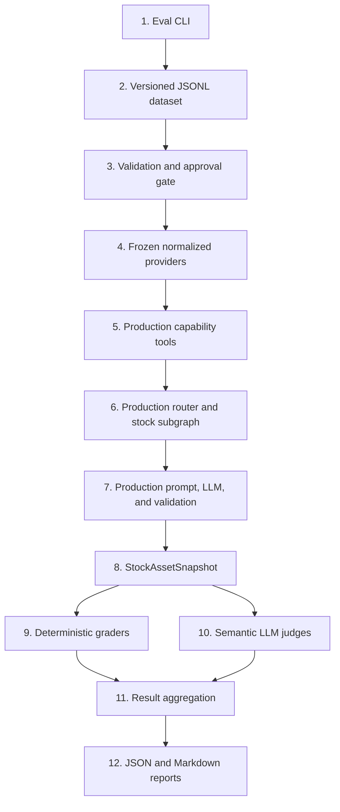

# Spider-AI Evals

This directory contains project-owned, local-first evaluation harnesses. The
current implementation evaluates the production Stock Asset Snapshot workflow.

The dependency direction is intentionally one-way:

```text
evals -> production code
```

Production code must never import from `evals/`, and production graphs must not
contain an `evaluation_mode` branch.

## Top-to-bottom execution flow



### 1. CLI and execution control

[`asset_snapshot/run.py`](asset_snapshot/run.py) is the entry point. It:

- parses dataset, case, category, review-status, grader, and output options;
- loads and filters cases before constructing an LLM client;
- creates the generation client and optional independent judge client;
- invokes `StockSnapshotEvaluator` and writes both report formats.

The default command selects only approved cases. If none exist, it exits before
constructing either model:

```bash
uv run python -m evals.asset_snapshot.run
```

### 2. Versioned dataset

[`datasets/stock_snapshot_v1.jsonl`](datasets/stock_snapshot_v1.jsonl) contains
one `StockSnapshotEvalCase` per line. JSONL keeps cases independently parseable,
reviewable, and diffable.

Each case has two distinct parts:

- **Provider fixtures** describe the normalized context supplied to production.
- **Expectations** describe behavior the generated snapshot should demonstrate.

There is deliberately no canonical golden paragraph. Different answers can be
correct when they satisfy the same product requirements.

Dataset ownership, approval, and versioning rules are documented in
[`datasets/README.md`](datasets/README.md). The case-by-case review table is
[`datasets/stock_snapshot_v1_review.md`](datasets/stock_snapshot_v1_review.md).

### 3. Typed models and approval gate

[`asset_snapshot/models.py`](asset_snapshot/models.py) defines:

- `StockSnapshotEvalCase` for requests, fixtures, and expectations;
- `EvalCaseMetadata` for provenance, review status, and case taxonomy;
- grader result models and the final `StockSnapshotEvalReport`;
- validation that fixtures match the requested stock asset.

[`asset_snapshot/dataset.py`](asset_snapshot/dataset.py) owns JSONL loading,
Pydantic validation, duplicate-ID detection, filtering, and status counts.
`select_cases()` includes only `approved` cases unless `--include-pending` is
explicitly supplied.

The metadata dimensions must not be conflated:

```text
fixture composition = what kind of frozen data the case contains
provenance          = where the case originated
review status       = whether a person accepted it for evaluation
grounding           = whether external evidence supports its claims
```

The initial v1 cases are AI-generated and pending review. A label such as
`stable_qualitative` describes the intended content shape only; it does not
prove that a real-company claim is correct, sourced, or durable.

### 4. Frozen provider layer

[`asset_snapshot/frozen.py`](asset_snapshot/frozen.py) replaces live market-data
providers with:

- `FrozenCompanyProfileProvider`;
- `FrozenCompanyPeersProvider`;
- `FrozenFundamentalsProvider`.

Each provider returns a deep copy of the case fixture and exposes a call counter
for tests. Missing fixtures return the same normalized empty result expected by
the production tools. These providers contain no yfinance or FMP dependency, so
fictional tickers cannot escape to the network.

`build_frozen_execution()` is the composition root for one case. It injects the
frozen providers into real production tools and assembles the real graph runner.

### 5. Production capability tools

The frozen providers are injected into the real
[`CompanyProfileTool`, `CompanyPeersTool`, and `CompanyFundamentalsTool`](../app/agents/asset_snapshot/tools/__init__.py).
The eval harness therefore exercises the same provider-facing contracts and
normalized domain contexts as the application.

The tools remain production code. The eval layer does not create alternative
benchmark-specific tool behavior or pass raw fixture JSON to the model.

### 6. Production graph execution

The real [`StockSnapshotSubgraph`](../app/agents/asset_snapshot/stock/graph.py)
is injected into the real
[`AssetSnapshotRouterGraph`](../app/agents/asset_snapshot/router/graph.py), then
invoked through
[`AssetSnapshotGraphRunner`](../app/agents/asset_snapshot/runner.py).

This preserves production orchestration, missing-data behavior, `data_scope`
selection, prompt generation, LLM invocation, JSON parsing, and Pydantic
validation. Only external market-data dependencies are frozen.

### 7. Generation and production validation

The stock subgraph uses the production
[`StockSnapshotPromptBuilder`](../app/llm/prompts/feature_snapshot_prompt_builder.py)
and a `BaseChatModelClient`. Production output must validate against
[`StockAssetSnapshot`](../app/domain/schemas/asset_snapshot.py).

The generation model is the system under evaluation. It must not be confused
with the judge model used later. Typing the subgraph against
[`BaseChatModelClient`](../app/llm/base.py) allows tests and evals to inject a
client without changing graph behavior.

### 8. Deterministic graders

[`asset_snapshot/graders.py`](asset_snapshot/graders.py) contains checks whose
results should not require model judgment:

- `SchemaValidityGrader` validates the production response schema.
- `SafetyGrader` detects narrow advice and prediction patterns.
- `RequiredFieldGrader` checks required product content.
- `DataScopeGrader` applies production fallback rules.
- `UnsupportedNumericClaimGrader` checks the four exposed operating-economics
  signals: revenue, revenue growth, operating margin, and debt-to-equity ratio.
- `ForbiddenClaimGrader` checks normalized case-specific mistakes.
- `UnsupportedCompetitorGrader` enforces supplied peers for opted-in cases.

These graders are intentionally narrow. They do not attempt arbitrary financial
fact-checking or semantic correctness.

### 9. Semantic LLM judges

[`asset_snapshot/judge.py`](asset_snapshot/judge.py) defines independent,
rubric-based `LLMJudgeGrader` instances for:

- business-model correctness;
- structural-risk quality;
- risk-mechanism quality;
- groundedness against supplied fixtures;
- company specificity.

Each judge returns the structured `JudgeResult` schema with a score of `0`, `1`,
or `2`, a concise reason, and one to three evidence references. Every reference
contains a snapshot `field_path` and a literal quote copied from that field, for
example `structural_risks[0].explanation`. The evaluator verifies that each quote
is really present in the generated `StockAssetSnapshot`; fabricated or
paraphrased items are discarded. Container paths such as
`structural_risks[0].related_competitors` are validated against their serialized
list value. At most three valid, unique evidence items are retained; a metric
fails only when the judge returns no evidence that can be verified against the
snapshot.

The judge receives the request, normalized fixtures, expectations, generated
snapshot, and one narrow rubric. It does not receive the production generation
prompt and is instructed not to use current market knowledge.

[`asset_snapshot/eval_llm.py`](asset_snapshot/eval_llm.py) provides
`EvalOllamaClient`, allowing `EVAL_JUDGE_MODEL` and `EVAL_JUDGE_BASE_URL` to be
configured independently from the generation model.
[`asset_snapshot/config.py`](asset_snapshot/config.py) loads those values from
the process environment or the project `.env` file. Process environment values
take precedence; empty values fall back to `OLLAMA_CHAT_MODEL` and
`OLLAMA_BASE_URL`.

```dotenv
EVAL_JUDGE_MODEL=qwen3:8b
EVAL_JUDGE_BASE_URL=http://localhost:11434
```

### 10. Evaluation runner and aggregation

[`asset_snapshot/runner.py`](asset_snapshot/runner.py) defines
`StockSnapshotEvaluator`. For each case it:

1. builds an isolated frozen production execution;
2. generates a validated `StockAssetSnapshot`;
3. runs deterministic graders;
4. optionally runs semantic judges;
5. records latency, errors, metric results, and failure labels.

The runner then calculates deterministic pass rates, semantic averages, and the
weakest cases. Generation and judge failures become controlled case results
instead of terminating the complete run.

### 11. Reports

[`asset_snapshot/reporting.py`](asset_snapshot/reporting.py) writes equivalent
machine-readable JSON and human-readable Markdown reports. Reports include the
dataset version, Git commit, model identifiers, review counts, latency,
aggregate metrics, and weakest cases. Every Markdown case section also shows:

- its deterministic pass score and every deterministic metric result;
- its semantic average, judge coverage such as `3/5 graded`, and every semantic
  metric score;
- the failure labels and judge reason attached to each metric;
- exact, field-addressed excerpts from the core LLM snapshot supporting each
  semantic judgment.

Generated files are written under `evals/reports/` by default and ignored by
Git. Runs containing pending cases are visibly marked:

```text
NON-BASELINE / UNREVIEWED DATASET RUN
```

### 12. Tests

The normal test suite never calls live providers or a real judge model:

- [`test_evals_dataset.py`](../tests/test_evals_dataset.py) tests schema and review gates.
- [`test_evals_execution.py`](../tests/test_evals_execution.py) tests frozen production execution and reporting.
- [`test_evals_graders.py`](../tests/test_evals_graders.py) tests deterministic graders and structured judge parsing.

## Logging and troubleshooting

The eval CLI initializes the same Rich-powered logging configuration as the
application. A normal run logs:

- dataset path, validation counts, and selection filters;
- run ID, models, grader counts, and review status;
- each case's lifecycle and frozen fixture availability;
- production graph and LLM steps;
- every deterministic grader result;
- every semantic judge invocation, score, and controlled failure;
- aggregate pass rates, weakest cases, and report paths.

Enable detailed, readable terminal logs with:

```bash
APP_PRETTY_LOGS=true \
APP_DEBUG=true \
APP_LOG_FLOW_STEPS=true \
uv run python -m evals.asset_snapshot.run \
  --dataset stock_snapshot_v1
```

`INFO` records show execution progress. `APP_DEBUG=true` additionally shows
fixture hit/miss details and case expectation summaries. Every evaluator run has
a short `run_id`, while every case and grader record contains `case_id` and
`metric` where applicable.

Prompts and model outputs are hidden by default. They can contain large or
sensitive payloads, so enable previews only while diagnosing model behavior:

```bash
APP_LOG_LLM_PROMPTS=true \
APP_LOG_LLM_OUTPUTS=true \
APP_LOG_PREVIEW_CHARS=3000 \
uv run python -m evals.asset_snapshot.run \
  --dataset stock_snapshot_v1 \
  --case ma_payment_network_001
```

Generation-client logs use `llm.generate.*`; semantic judge-client logs use
`eval.judge.llm.*`. This makes it possible to distinguish the model being
evaluated from the model grading its output.

## Common commands

Validate dataset structure without invoking a model:

```bash
uv run python -m evals.asset_snapshot.run --validate-only
```

Run approved cases with deterministic and semantic graders:

```bash
uv run python -m evals.asset_snapshot.run --dataset stock_snapshot_v1
```

Run only deterministic graders:

```bash
uv run python -m evals.asset_snapshot.run \
  --dataset stock_snapshot_v1 \
  --deterministic-only
```

Explore pending cases explicitly, without treating the report as a baseline:

```bash
uv run python -m evals.asset_snapshot.run \
  --dataset stock_snapshot_v1 \
  --include-pending
```

Run an arbitrary subset by repeating `--case`. Cases execute once in dataset
order, even when an ID is repeated on the command line:

```bash
uv run python -m evals.asset_snapshot.run \
  --dataset stock_snapshot_v1 \
  --case ma_payment_network_001 \
  --case jpm_bank_001 \
  --case cloudx_saas_001
```

Do not run semantic evaluation against the generated v1 dataset until its cases
have been manually reviewed and changed to `review_status: "approved"`.
