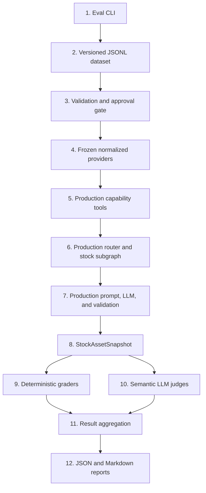

# Spider-AI Evals

This directory contains project-owned, local-first evaluation harnesses. The
current implementation evaluates the production Stock Asset Snapshot workflow.

The dependency direction is intentionally one-way:

```text
evals -> production code
```

Production code must never import from `evals/`, and production graphs must not
contain an `evaluation_mode` branch.

## Top-to-bottom execution flow



### 1. CLI and execution control

[`asset_snapshot/run.py`](asset_snapshot/run.py) is the entry point. It:

- parses dataset, case, category, review-status, grader, peer-context, and output options;
- loads and filters cases before constructing an LLM client;
- creates the generation client and optional independent judge client;
- invokes `StockSnapshotEvaluator` and writes both report formats.

`--compare-prompts` selects the original/compressed A/B wrapper described below;
case selection and review gates remain the same.

The default command selects only approved cases. If none exist, it exits before
constructing either model:

```bash
uv run python -m evals.asset_snapshot.run
```

### 2. Versioned dataset

[`datasets/stock_snapshot_v1.jsonl`](datasets/stock_snapshot_v1.jsonl) contains
one `StockSnapshotEvalCase` per line. JSONL keeps cases independently parseable,
reviewable, and diffable.

Each case has two distinct parts:

- **Provider fixtures** describe the normalized context supplied to production.
- **Expectations** describe behavior the generated snapshot should demonstrate.

There is deliberately no canonical golden paragraph. Different answers can be
correct when they satisfy the same product requirements.

Dataset ownership, approval, and versioning rules are documented in
[`datasets/README.md`](datasets/README.md). The case-by-case review table is
[`datasets/stock_snapshot_v1_review.md`](datasets/stock_snapshot_v1_review.md).

### 3. Typed models and approval gate

[`asset_snapshot/models.py`](asset_snapshot/models.py) defines:

- `StockSnapshotEvalCase` for requests, fixtures, and expectations;
- `EvalCaseMetadata` for provenance, review status, and case taxonomy;
- grader result models and the final `StockSnapshotEvalReport`;
- validation that fixtures match the requested stock asset.

[`asset_snapshot/dataset.py`](asset_snapshot/dataset.py) owns JSONL loading,
Pydantic validation, duplicate-ID detection, filtering, and status counts.
`select_cases()` includes only `approved` cases unless `--include-pending` is
explicitly supplied.

The metadata dimensions must not be conflated:

```text
fixture composition = what kind of frozen data the case contains
provenance          = where the case originated
review status       = whether a person accepted it for evaluation
grounding           = whether external evidence supports its claims
```

The initial v1 cases are AI-generated and pending review. A label such as
`stable_qualitative` describes the intended content shape only; it does not
prove that a real-company claim is correct, sourced, or durable.

### 4. Frozen provider layer

[`asset_snapshot/frozen.py`](asset_snapshot/frozen.py) replaces live market-data
providers with:

- `FrozenCompanyProfileProvider`;
- `FrozenCompanyPeersProvider`;
- `FrozenFundamentalsProvider`.

Each provider exposes a call counter and returns independent fixture data.
The peers provider returns candidate identities with profiles stripped; the profile
provider serves both the target fixture and the nested candidate profile fixtures.
The production peers tool must retrieve those profiles to enrich the context.
Thus tests exercise enrichment rather than bypassing it with precomputed analysis.
Missing fixtures return the same normalized empty result expected by
the production tools. These providers contain no yfinance or FMP dependency, so
fictional tickers cannot escape to the network.

`build_frozen_execution()` is the composition root for one case. It injects the
frozen providers into real production tools and assembles the real graph runner.

### 5. Production capability tools

The frozen providers are injected into the real
[`CompanyProfileTool`, `CompanyPeersTool`, and `CompanyFundamentalsTool`](../app/agents/asset_snapshot/tools/__init__.py).
The eval harness therefore exercises the same provider-facing contracts and
normalized domain contexts as the application.

Each `build_frozen_execution()` constructs fresh tools with isolated five-hour
in-memory result caches. No API dependency-factory singleton is reused, so one
case cannot receive another case's cached evidence, even for the same ticker.
Repeated calls within one execution can reuse successful normalized results;
empty results remain retryable. Peer cache entries include enrichment, not just
the discovered identities. Expiry and fresh mocked vendor requests are covered
by [`test_tool_caching.py`](../tests/test_tool_caching.py).

The tools remain production code. The eval layer does not create alternative
benchmark-specific tool behavior or pass raw fixture JSON to the model.

### 6. Production graph execution

The real [`StockSnapshotSubgraph`](../app/agents/asset_snapshot/stock/graph.py)
is injected into the real
[`AssetSnapshotRouterGraph`](../app/agents/asset_snapshot/router/graph.py), then
invoked through
[`AssetSnapshotGraphRunner`](../app/agents/asset_snapshot/runner.py).

This preserves production orchestration, missing-data behavior, `data_scope`
selection, prompt generation, structured LLM invocation, Pydantic validation,
and context-aware finalization. Only external market-data dependencies are frozen.

### 7. Generation and production validation

The stock subgraph uses the production
[`StockSnapshotPromptBuilder`](../app/llm/prompts/feature_snapshot_prompt_builder.py)
and a `BaseChatModelClient`. Production output must validate against
[`StockAssetSnapshot`](../app/domain/schemas/asset_snapshot.py).

#### Peer-context ablation

The builder projects full enriched peer evidence into prompt-only fields via
[`CompanyPeerPromptProjection`](../app/llm/prompts/company_peer_projection.py).
Production and evals default to `compact`; this keeps ticker, name, sector,
industry, and literal opening business text. Summaries have a 1,200-character,
five-sentence budget, with a word-boundary fallback. Short summaries are preserved
after whitespace normalization when within both limits. Both original/compressed
feature-prompt variants use this same projection. No LLM summarization or peer
filtering is added.

Select a representation with `--peer-context`:

- `names_only`: peer ticker/name only, without profile facts or profile attribution.
- `compact`: bounded profile projection, with discovery and profile provenance.
- `full`: previous verbose profile rendering, including its existing
  1,200-character summary cap and repeated profile metadata.

For example, run the same approved case separately with each mode:

```bash
uv run python -m evals.asset_snapshot.run --case amzn_peer_profiles_001 --peer-context names_only
uv run python -m evals.asset_snapshot.run --case amzn_peer_profiles_001 --peer-context compact
uv run python -m evals.asset_snapshot.run --case amzn_peer_profiles_001 --peer-context full
```

These commands call the configured generation and judge LLMs. `--deterministic-only`
skips judges, not generation. Keep dataset, case selection, model settings, and
judge settings fixed between runs; repeat runs to account for model variability.
Retrieval, full cached/persisted evidence, peer count/order, target profile, feature
instructions, and grading expectations stay unchanged. Missing profile facts
remain absent. The projection performs no relationship classification.

The CLI passes the option through `StockSnapshotEvaluator` and
`build_frozen_execution()` into the production builder. JSON reports record
`peer_context_mode`; Markdown shows `Peer context`. Historical reports without
this metadata are displayed as `not recorded`, not mislabeled as compact.
DEBUG logs show `snapshot_prompt.peer_context` (count, characters, mode).
Native model traces can expose token-usage metadata. Character reduction
does not prove quality improvement or that the full prompt fits the context window.

[`test_peer_prompt_projection.py`](../tests/test_peer_prompt_projection.py) covers
field whitelisting, truncation, missing profiles, provenance, and retained peers.
[`test_evals_execution.py`](../tests/test_evals_execution.py) checks mode wiring,
full evidence preservation through cache reuse, and one mocked generation call
per run. Existing fixture contents and semantic expectations are not rewritten.

The generation model is the system under evaluation. It must not be confused
with the judge model used later. Typing the subgraph against
[`BaseChatModelClient`](../app/llm/base.py) allows tests and evals to inject a
client without changing graph behavior.

The production generation client receives `response_schema=StockAssetSnapshot`
and calls `with_structured_output(response_schema)` followed by one `ainvoke`.
The installed ChatOllama defaults to JSON-schema output and returns a validated
Pydantic model without a raw-response wrapper. There is no application-level retry
or repair prompt. Generation/parsing failures are reported as `generation_failure`;
provider tools and the case are not rerun. The graph receives the typed model
directly in `validated_output`, then normalizes trusted metadata, restores omitted
peer tickers from unambiguous supplied identities, and checks peer omissions without
re-parsing JSON. Graders evaluate this finalized product output, not the uncorrected
model response; restorations are logged. Original responses remain in model traces.
Semantic judge calls remain unchanged. Schema-valid semantic failures are still
graded normally.
[`test_structured_output.py`](../tests/test_structured_output.py) exercises the
real LangChain schema binding/parser with mocked model I/O, checking schema delivery,
typed output, single-call behavior on success and failure, cancellation, and the
graph's controlled error path. Frozen fixtures and grading criteria are unchanged.

#### Original vs Compressed Prompt Evaluation

Static feature-prompt distillation is independent of peer-context projection.
The [semantic coverage audit](../docs/asset_snapshot_prompt_compression.md)
documents the preserved rules and character measurements. Only the feature
template differs in this experiment, not evidence, peer mode, schema, or settings.

Top-to-bottom comparison flow:

1. [`run.py`](asset_snapshot/run.py) selects the frozen cases once and creates one
   generation client and the separately configured `EVAL_JUDGE_MODEL` client.
2. [`PromptComparisonEvaluator`](asset_snapshot/comparison.py) wraps two existing
   `StockSnapshotEvaluator` instances. One uses the verbose eval-only
   [`original_feature_prompt.py`](asset_snapshot/original_feature_prompt.py);
   the other uses the compact production prompt. Both are rebased to the current
   peer-landscape schema and stable-knowledge policy. Generation order alternates by case.
3. Each execution builds fresh frozen providers/tools/caches. The same production
   builder accepts the injected template. Existing deterministic and five semantic
   graders evaluate both outputs against unchanged expectations.
4. [`MeasuredSnapshotPromptBuilder`](asset_snapshot/prompt_measurements.py) records
   static feature/system and dynamic context characters separately, plus prompt
   and dynamic-context hashes. Only missing-provider fallback timestamps are fixed
   to an eval-only sentinel; supplied fixture facts/timestamps and canonical evidence
   remain unchanged. This prevents wall-clock noise from breaking the control.
5. [`PairwiseSnapshotJudge`](asset_snapshot/pairwise.py) sees the frozen evidence,
   expectations, and two outputs labeled A/B, not prompt variants. It judges both
   orders and verifies literal quotes against the correct candidate. The rubric
   covers business-model correctness, specificity, grounding, causal risks,
   unsupported numbers, and peer coverage. A meaningful tie is allowed.
6. [`comparison_reporting.py`](asset_snapshot/comparison_reporting.py) writes JSON
   and Markdown with per-case/aggregate metrics, both complete snapshots, pairwise
   reasons and exact evidence, sizes, hashes, settings, and generation latency
   excluding judging (but including tool orchestration).

Run the approved frozen set with all graders and pairwise comparison:

```bash
LANGSMITH_TRACING=false LANGCHAIN_TRACING_V2=false \
uv run python -m evals.asset_snapshot.run --compare-prompts
```

Use the existing repeated `--case` selection for a smaller experiment:

```bash
uv run python -m evals.asset_snapshot.run --compare-prompts \
  --case amzn_peer_profiles_001 --case ma_sparse_peers_001 \
  --peer-context compact --output evals/reports/prompt_ab
```

`--pairwise-only` keeps deterministic checks and two-order pairwise judging but
skips individual semantic graders. `--deterministic-only` skips all judges, including
pairwise, but still generates both snapshots. `--pairwise-only` requires
`--compare-prompts` and cannot be combined with `--deterministic-only`.

For a successfully generated case, full A/B uses two generation calls, ten semantic
judge calls, and two pairwise calls; pairwise-only uses four total calls. These extra
calls are eval-only. No live market-data provider or database persistence is used.
Unit tests replace the generation and judge clients too.

Report interpretation:

- A pair counts as a win/tie only if both orders agree after mapping back to variants.
- `order_disagreement`, `judge_failure`, `generation_failure`, `context_mismatch`,
  and `not_run` are separate statuses, never wins or ties. Quotes verify attribution,
  not whether the judge's reasoning is sound. A tie can mean both outputs are poor.
- Dynamic context mismatch prevents pairwise judging. Inspect the underlying case
  results before using aggregate scores; generation failures have no semantic score.
- Reports retain full outputs for human review. Deterministic checks are narrow;
  schema validity and peer coverage do not establish economic correctness.
- Prompt counts are characters, not tokens. `num_ctx` remains the unchanged server/
  model default, not pinned by the harness; no seed is set. Keep server/model settings
  fixed, check for truncation, and repeat multiple samples before claiming regression
  protection. Alternating order reduces but does not eliminate warmup/order effects.
- Template, system, output-schema, and selected-fixture hashes identify a run even
  with uncommitted changes. Generation/judge models and temperatures are recorded.

The initial one-case pilot and its inconclusive pairwise result are documented in
the [compression audit](../docs/asset_snapshot_prompt_compression.md#local-pilot-2026-09-16).
[`test_prompt_compression.py`](../tests/test_prompt_compression.py) checks instruction
coverage, matching schema examples/current policy, and unchanged dynamic context.
[`test_prompt_comparison.py`](../tests/test_prompt_comparison.py) checks A/B isolation,
two-order decisions/ties, quote validation, controlled failures, CLI wiring, and reports.

### 8. Deterministic graders

[`asset_snapshot/graders.py`](asset_snapshot/graders.py) contains checks whose
results should not require model judgment:

- `SchemaValidityGrader` validates the production response schema.
- `SafetyGrader` detects narrow advice and prediction patterns.
- `RequiredFieldGrader` checks required product content.
- `DataScopeGrader` applies production fallback rules.
- `UnsupportedNumericClaimGrader` checks the four exposed operating-economics
  signals: revenue, revenue growth, operating margin, and debt-to-equity ratio.
- `ForbiddenClaimGrader` checks normalized case-specific mistakes.
- `UnsupportedPeerRelationshipGrader` (`unsupported_peer_relationships`) enforces
  supplied peer identities for opted-in cases and checks that `related_entities`
  resolve to both supplied and output peers. It does NOT classify relationships
  or prove that a risk connection is economically justified.
- `PeerCoverageGrader` requires acknowledgment of all distinct identifiable
  provider-reported peers, using tickers or normalized names. Supplied tickers must
  also be preserved; a matching name does not excuse a dropped ticker. It rejects blank or
  bare-placeholder relationship fields and duplicate entries, but accepts explanatory
  uncertainty and all four valid types, including `comparable` and `unclear`.
  There is no curated inclusion/exclusion list and no profile-based eligibility test.

The existing five semantic judges (no additional judge call) assess peer-type
correctness, direct-competition overclaiming, justified indirect substitution,
appropriate comparability/uncertainty, specific relationship areas, grounded
explanations, target-focused economic mechanisms, and risk-reference relevance.
The single `why_relevant` must cover both why the entity is related and how that
relationship matters economically, or explicitly explain the evidence limitation.
Merging the output fields does not remove either semantic assessment; a bare
high/medium/low value is rejected by the deterministic placeholder check.
Groundedness and company-specificity carry the relationship criteria; structural-risk
quality also checks whether `related_entities` genuinely belong in each mechanism.
Empty risk references are valid when no supplied peer materially participates;
not every risk must be competitive. Judges also check that classifications agree
with their explanations rather than accepting a broad sector label by itself.
Pairwise judging uses the same shared policy.

Provider evidence is primary. Stable, high-confidence, widely established,
structurally persistent knowledge may supplement even present/compact profiles.
Judges distinguish provider grounding, stable-knowledge support, and unsupported
assertions; they do not require every fact to literally appear in the fixtures.
They penalize contradictions, invented numerical/current/obscure relationships,
and speculative competition. Fictional entities do not acquire facts from model
memory. Missing profiles alone do not force `unclear`; broad similarity supports
`comparable`, otherwise insufficient reliable support requires `unclear`.
Numeric checks remain strict, and missing financial data is not negative evidence.

These graders are intentionally narrow. They do not attempt arbitrary financial
fact-checking or semantic correctness.

### 9. Semantic LLM judges

[`asset_snapshot/judge.py`](asset_snapshot/judge.py) defines independent,
rubric-based `LLMJudgeGrader` instances for:

- business-model correctness;
- structural-risk quality;
- risk-mechanism quality;
- groundedness against supplied fixtures;
- company specificity.

Each judge returns the structured `JudgeResult` schema with a score of `0`, `1`,
or `2`, a concise reason, and one to three evidence references. Every reference
contains a snapshot `field_path` and a literal quote copied from that field, for
example `structural_risks[0].explanation`. The evaluator verifies that each quote
is really present in the generated `StockAssetSnapshot`; fabricated or
paraphrased items are discarded. Container paths such as
`structural_risks[0].related_entities` are validated against their serialized
list value. At most three valid, unique evidence items are retained; a metric
fails only when the judge returns no evidence that can be verified against the
snapshot.

The judge receives the entity kind (real/fictional), request, normalized fixtures,
expectations including optional `peer_relationship_guidance`, generated
snapshot, and one narrow rubric. It does not receive the production generation
prompt and is instructed not to use current market knowledge. It may use only the
permitted stable secondary knowledge described above. Literal quote verification
checks attribution to output, not factual truth: semantic judgments still need review.

[`asset_snapshot/eval_llm.py`](asset_snapshot/eval_llm.py) provides
`EvalOllamaClient`, allowing `EVAL_JUDGE_MODEL` and `EVAL_JUDGE_BASE_URL` to be
configured independently from the generation model.
[`asset_snapshot/config.py`](asset_snapshot/config.py) loads those values from
the process environment or the project `.env` file. Process environment values
take precedence; empty values fall back to `OLLAMA_CHAT_MODEL` and
`OLLAMA_BASE_URL`.

```dotenv
EVAL_JUDGE_MODEL=qwen3:8b
EVAL_JUDGE_BASE_URL=http://localhost:11434
```

### 10. Evaluation runner and aggregation

[`asset_snapshot/runner.py`](asset_snapshot/runner.py) defines
`StockSnapshotEvaluator`. For each case it:

1. builds an isolated frozen production execution;
2. generates a validated `StockAssetSnapshot`;
3. runs deterministic graders;
4. optionally runs semantic judges;
5. records latency, errors, metric results, and failure labels.

The runner then calculates deterministic pass rates, semantic averages, and the
weakest cases. Generation and judge failures become controlled case results
instead of terminating the complete run.

### 11. Reports

[`asset_snapshot/reporting.py`](asset_snapshot/reporting.py) writes equivalent
machine-readable JSON and human-readable Markdown reports. Reports include the
dataset version, Git commit, model identifiers, review counts, latency,
aggregate metrics, and weakest cases. Every Markdown case section also shows:

- its deterministic pass score and every deterministic metric result;
- its semantic average, judge coverage such as `3/5 graded`, and every semantic
  metric score;
- the failure labels and judge reason attached to each metric;
- exact, field-addressed excerpts from the core LLM snapshot supporting each
  semantic judgment.

Generated files are written under `evals/reports/` by default and ignored by
Git. Runs containing pending cases are visibly marked:

```text
NON-BASELINE / UNREVIEWED DATASET RUN
```

### 12. Tests

The normal test suite never calls live providers or a real judge model:

- [`test_evals_dataset.py`](../tests/test_evals_dataset.py) tests schema and review gates.
- [`test_evals_execution.py`](../tests/test_evals_execution.py) tests frozen production execution and reporting.
- [`test_evals_graders.py`](../tests/test_evals_graders.py) tests deterministic graders and structured judge parsing.

## Logging and troubleshooting

The eval CLI initializes the same Rich-powered logging configuration as the
application. A normal run logs:

- dataset path, validation counts, and selection filters;
- run ID, models, grader counts, and review status;
- each case's lifecycle and frozen fixture availability;
- production graph and LLM steps;
- every deterministic grader result;
- every semantic judge invocation, score, and controlled failure;
- aggregate pass rates, weakest cases, and report paths.

Enable detailed, readable terminal logs with:

```bash
APP_PRETTY_LOGS=true \
APP_DEBUG=true \
APP_LOG_FLOW_STEPS=true \
uv run python -m evals.asset_snapshot.run \
  --dataset stock_snapshot_v1_peer_landscape_v2
```

`INFO` records show execution progress. `APP_DEBUG=true` additionally shows
fixture hit/miss details and case expectation summaries. Every evaluator run has
a short `run_id`, while every case and grader record contains `case_id` and
`metric` where applicable.

Prompts and model outputs are hidden by default. They can contain large or
sensitive payloads, so enable previews only while diagnosing model behavior:

```bash
APP_LOG_LLM_PROMPTS=true \
APP_LOG_LLM_OUTPUTS=true \
APP_LOG_PREVIEW_CHARS=3000 \
uv run python -m evals.asset_snapshot.run \
  --dataset stock_snapshot_v1_peer_landscape_v2 \
  --case ma_payment_network_001
```

Generation-client logs use `llm.generate.*`; semantic judge-client logs use
`eval.judge.llm.*`. This makes it possible to distinguish the model being
evaluated from the model grading its output.

## Common commands

Validate dataset structure without invoking a model:

```bash
uv run python -m evals.asset_snapshot.run --validate-only
```

Run approved cases with deterministic and semantic graders:

```bash
uv run python -m evals.asset_snapshot.run --dataset stock_snapshot_v1_peer_landscape_v2
```

Run only deterministic graders:

```bash
uv run python -m evals.asset_snapshot.run \
  --dataset stock_snapshot_v1_peer_landscape_v2 \
  --deterministic-only
```

Explore pending cases explicitly, without treating the report as a baseline:

```bash
uv run python -m evals.asset_snapshot.run \
  --dataset stock_snapshot_v1_peer_landscape_v2 \
  --include-pending
```

Run an arbitrary subset by repeating `--case`. Cases execute once in dataset
order, even when an ID is repeated on the command line:

```bash
uv run python -m evals.asset_snapshot.run \
  --dataset stock_snapshot_v1_peer_landscape_v2 \
  --case ma_payment_network_001 \
  --case jpm_bank_001 \
  --case cloudx_saas_001
```

Do not run semantic evaluation against the generated v1 dataset until its cases
have been manually reviewed and changed to `review_status: "approved"`.
